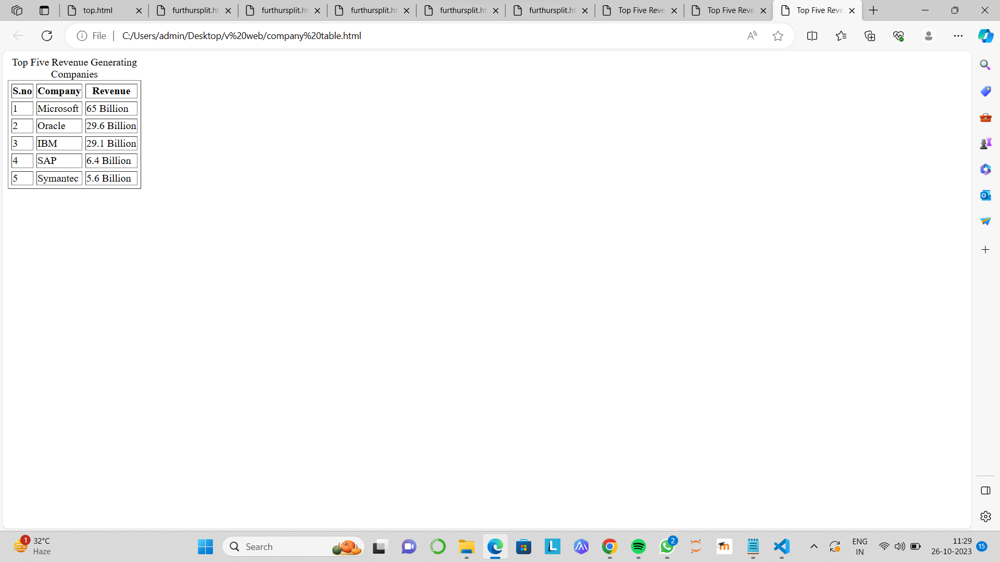

# EX01 Developing a Simple Webserver
## Date:

## AIM:
To develop a simple webserver to serve html pages.

## DESIGN STEPS:
### Step 1: 
HTML content creation.

### Step 2:
Design of webserver workflow.

### Step 3:
Implementation using Python code.

### Step 4:
Serving the HTML pages.

### Step 5:
Testing the webserver.

## PROGRAM:
```
<html>
      <title>Top Five Revenue Generating Companies</title>
	<body>
		<table border="1" cellspacing="5" cell padding="3">
			<caption> Top Five Revenue Generating Companies </caption>
			<tr>
				<th>S.no</th>
				<th>Company</th>
				<th>Revenue</th>
			</tr>
			<tr>
				<td>1</td>
				<td>Microsoft</td>
				<td>65 Billion</td>
			</tr>
			<tr>
				<td>2</td>
				<td>Oracle</td>
				<td>29.6 Billion</td>
			</tr>
		      <tr>
				<td>3</td>
				<td>IBM</td>
				<td>29.1 Billion</td>
			</tr>
		      <tr>
				<td>4</td>
				<td>SAP</td>
				<td>6.4 Billion</td>
			</tr>
		      <tr>
				<td>5</td>
				<td>Symantec</td>
				<td>5.6 Billion</td>
			</tr>
		</table>
	</body>
</html>
```
## OUTPUT:


## RESULT:
The program for implementing simple webserver is executed successfully.
